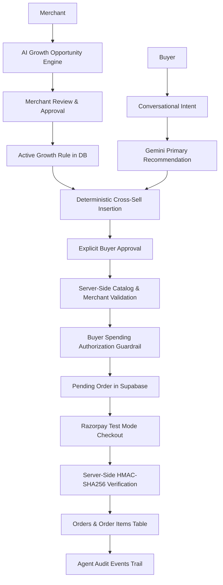

# Merchant AI Commerce

An AI-assisted commerce platform for **Track 01 — AI Growth & Agentic Commerce**, where AI understands buyer intent and merchants can approve revenue-positive cross-sell rules, while all money movement remains bounded, authorized, server-controlled, and auditable.

---

## Track 01 Alignment

Merchant AI Commerce directly addresses the core themes of **Track 01: AI Growth & Agentic Commerce**:

- **AI Growth**: Empowers merchants to discover high-value cross-sell opportunities from their live catalog using Gemini, converting passive catalog browsing into proactive, merchant-governed revenue expansion.
- **Agentic Commerce**: Enables buyers to shop conversationally using natural language, while an autonomous agent constructs coherent recommendations and purchase proposals within strict parameters.
- **Agent-Readable / Structured Catalog**: Catalog products are structured with strict schemas (IDs, pricing in minor units, currency, status, and merchant ownership) so AI models and validation layers can parse and verify them without hallucination.
- **Upsell & Cross-Sell**: Distinguishes between primary product intent and complementary add-ons. Cross-sells are never invented by the AI; they are triggered by explicit, merchant-approved growth rules.
- **Conversational Buyer Experience**: Buyers express intent freely in natural language ("I need running shoes for everyday training"), receiving explainable recommendations directly mapped to available stock.
- **Bounded and Gated Transactions**: Transactions are gated by server-side spending authorizations and explicit buyer approvals. No agent possesses unilateral spending authority.
- *(Note on Scope: Campaign orchestration across external marketing channels is not implemented; this prototype focuses strictly on the catalog intelligence, merchant rule governance, and bounded transactional execution core).*

---

## The Core Idea

> **"The LLM recommends; it does not control money."**

In agentic commerce, granting an LLM direct API access to create charges, authorize transactions, or deduct funds introduces severe risks of prompt injection, hallucination, and runaway spending.

Merchant AI Commerce enforces a strict architectural boundary:
1. **Google Gemini** is used purely for semantic reasoning: interpreting buyer intent, mapping requests to primary catalog items, and proposing candidate growth opportunities to merchants.
2. **Merchant-Approved Growth Rules** govern cross-sell eligibility. The LLM cannot invent or activate cross-sell rules independently.
3. **The Server Application** deterministically validates all catalog references, derives tenant identities, enforces buyer spending authorizations, maintains order state machines, and prepares orders.
4. **Razorpay** handles payment execution in test mode.
5. **Supabase (PostgreSQL + RLS)** provides transactional persistence, row-level isolation, and append-oriented audit logging.

---

## Demo Flow

```
[ Merchant Flow ]
Catalog
  -> AI Growth Opportunity Analysis (Gemini)
  -> Merchant Review & Explicit Approval
  -> Active Merchant Growth Rule Persisted in Database

[ Buyer Flow ]
Natural-Language Buyer Intent
  -> AI Primary Product Recommendation (Gemini)
  -> Deterministic Cross-Sell Lookup (from Active Merchant Growth Rules)
  -> Explicit Buyer Review & Proposal Approval
  -> Server-Side Product, Merchant & Spending Authorization Validation
  -> Bounded Pending Order Creation
  -> Razorpay Checkout (Test Mode)
  -> Server-Side HMAC-SHA256 Payment Signature Verification
  -> Paid Order Persisted & Audit Trail Recorded
```

---

## Architecture



---

## AI vs Deterministic Responsibilities

| Responsibility Area | Handled By | Mechanism / Enforcement |
| :--- | :--- | :--- |
| **Buyer Intent Understanding** | AI (Gemini 3.6 Flash) | Natural language parsing of buyer requirements |
| **Primary Product Selection** | AI (Gemini 3.6 Flash) | Grounded catalog matching against active items |
| **Recommendation Explanations** | AI (Gemini 3.6 Flash) | Explainable rationale tied to buyer's stated criteria |
| **Growth Opportunity Proposal** | AI (Gemini 3.6 Flash) | Pairwise catalog analysis for complementary value |
| **Merchant Identity Derivation** | Server (Deterministic) | Server-side lookup via `merchant_members` (never client-supplied) |
| **Authentication & Authorization** | Server (Deterministic) | Supabase Auth session validation & Row Level Security (RLS) |
| **Catalog Validation** | Server (Deterministic) | Active status check, merchant isolation, price verification |
| **Cross-Sell Activation** | Server (Deterministic) | Strict lookup against `merchant_growth_rules` table |
| **Spending Limit Enforcement** | Server (Deterministic) | Server-side validation against `buyer_spending_authorizations` |
| **Order State Machine** | Server (Deterministic) | Atomic order creation and transition (`pending` -> `paid`) |
| **Buyer Proposal Approval** | Server (Deterministic) | Explicit user confirmation before order initialization |
| **Payment Signature Verification**| Server (Deterministic) | Cryptographic `HMAC-SHA256` validation using Razorpay secret |
| **Audit Logging** | Server (Deterministic) | Centralized, append-only `agent_audit_events` |
| **Idempotency & Replay Defense** | Server (Deterministic) | Session IDs, order status checks, unique constraint checks |

### Why This Separation Matters
If an AI agent can alter prices, inject ad-hoc line items, or authorize payments, an adversary could manipulate prompts to purchase unlisted goods or drain buyer accounts. By restricting Gemini to advisory roles (`primary` product matching) and enforcing cross-sells solely through merchant-signed database records, the economic integrity of the transaction remains deterministic and bounded.

---

## Safety and Money Controls

- **Server-Derived Merchant Context**: The system resolves merchant identity through authenticated session tokens via `merchant_members`, completely ignoring client-provided merchant IDs.
- **Row-Level Security (RLS)**: PostgreSQL policies isolate tenant data across merchants, products, orders, authorizations, and growth rules.
- **Buyer Spending Authorizations**: Buyers define an enforceable spending ceiling (`max_amount_minor`). The server strictly rejects order preparation if proposed totals exceed this threshold.
- **Explicit Two-Sided Approvals**:
  - *Merchants* must explicitly review and approve growth opportunities before they become active rules.
  - *Buyers* must explicitly approve proposed orders before any payment gateway session is created.
- **Deterministic Server-Side Product Validation**: Prices and currencies are loaded directly from the database; client-submitted or AI-suggested prices are disregarded.
- **Cryptographic Payment Verification**: Payment capture requires server-side `timingSafeEqual` comparison of HMAC-SHA256 signatures generated with `RAZORPAY_KEY_SECRET`.
- **Zero Unbounded AI Authority**: The LLM has no API keys, webhooks, or database permissions that enable financial transactions.

---

## Failure Handling

The safety controls have been verified through real boundary tests:

### Demonstrated Scenario: Spending Authorization Limit Exceeded
When a buyer attempted to purchase items totaling more than their configured spending authorization (e.g., cart exceeding ₹5,000):
1. **Detection**: `app/api/buyer/propose/route.js` computed the total against the authenticated buyer's `buyer_spending_authorizations` record.
2. **Transaction Blocked**: The server halted execution before order creation, returning HTTP `422 Unprocessable Entity` with error code `buyer_spending_limit_exceeded`.
3. **No Financial Exposure**: No order was inserted into the `orders` table, and no Razorpay order was initiated.
4. **Audit Logging**: A structured audit entry was recorded in `agent_audit_events` with `eventType: "limit_exceeded"`, `result: "blocked"`, and payload detailing the attempted amount vs. authorized limit.
5. **Actionable UI Feedback**: The buyer received a clear, non-blocking explanation directing them to adjust item quantities or raise their spending authorization.

---

## Auditability

Every critical decision—both AI recommendations and deterministic financial checkpoints—is persisted in the `agent_audit_events` table via `lib/agent-audit.js`:

- `ai_recommendation`: Logged when Gemini recommends products, capturing buyer query text, recommended product IDs, whether cross-sell rules were used, and rule IDs.
- `ai_growth_opportunity`: Logged when Gemini suggests a candidate cross-sell rule to a merchant.
- `ai_growth_rule_approved`: Logged when a merchant approves an AI growth rule into an active database rule.
- `purchase_proposed`: Logged when items and quantities are prepared into a proposal session.
- `purchase_approved`: Logged when a buyer explicitly confirms the proposed items.
- `limit_exceeded`: Logged when a transaction is blocked due to buyer spending authorization.
- `order_created`: Logged upon successful creation of a validated pending order.
- `payment_verified`: Logged when Razorpay payment HMAC signature is cryptographically verified.
- `payment_failed` / `checkout_failed`: Logged when checkout or verification encounters errors.

Each record captures `merchant_id`, `event_type`, `actor` (`ai_buyer`, `ai_merchant`, `system`), `payload` JSON, `result` (`success`, `blocked`, `error`), and `created_at` timestamp.

---

## Technology

- **Framework**: [Next.js](https://nextjs.org/) 16.3.4 (App Router, Turbopack, React Server Components)
- **UI & Styling**: [React](https://react.dev/) 19.2.8, [Tailwind CSS](https://tailwindcss.com/) v4
- **Database & Auth**: [Supabase](https://supabase.com/) (`@supabase/ssr` 0.12.5, `@supabase/supabase-js` 2.113.0) with PostgreSQL and Row Level Security
- **Payment Processing**: [Razorpay](https://razorpay.com/) (Standard Checkout in test mode + Node.js crypto HMAC-SHA256 server verification)
- **AI Intelligence**: [Google Gen AI SDK](https://www.npmjs.com/package/@google/genai) (`@google/genai` 2.21.0) running `gemini-3.6-flash`

---

## Project Structure

```
merchant-ai-commerce/
├── app/
│   ├── api/
│   │   ├── buyer/
│   │   │   ├── recommend/route.js     # Gemini intent parsing + DB growth rule lookup
│   │   │   ├── propose/route.js       # Catalog & buyer spending limit enforcement
│   │   │   ├── approve/route.js       # Explicit buyer proposal approval
│   │   │   └── checkout-event/route.js# Checkout telemetry audit logging
│   │   ├── merchant/
│   │   │   └── growth/
│   │   │       ├── opportunity/route.js # Gemini catalog cross-sell opportunity engine
│   │   │       └── approve/route.js     # Merchant growth rule approval (RPC)
│   │   ├── razorpay/
│   │   │   ├── orders/route.js        # Authenticated Razorpay order creation
│   │   │   └── payments/
│   │   │       └── verify/route.js    # Cryptographic HMAC payment verification
│   │   └── supabase-test/route.js     # Session & membership health check endpoint
│   ├── buyer/                         # Intelligent Buyer Console UI & spending limit controls
│   ├── dashboard/                     # Merchant workspace UI
│   │   ├── ai-growth/                 # AI Growth Console (opportunity discovery & approval)
│   │   ├── products/                  # Merchant catalog management
│   │   ├── orders/                    # Merchant order management & Razorpay modal
│   │   ├── customers/                 # Customer directory
│   │   ├── settings/                  # Store settings
│   │   └── ai-insights/               # Merchant intelligence view
│   ├── layout.js                      # Root layout
│   └── page.js                        # Landing page redirect / home
├── components/                        # Shared UI primitives & dashboard navigation
├── lib/
│   ├── agent-audit.js                 # Centralized agent_audit_events logging helper
│   └── supabase/
│       ├── admin.js                   # Privileged server client (audit logging)
│       ├── client.js                  # Browser Supabase client
│       └── server.js                  # SSR cookie-based Supabase client
└── supabase/
    └── migrations/                    # SQL migrations, RLS policies, tables & RPCs
```

---

## Getting Started

### Prerequisites
- Node.js 18.x or higher
- npm 9.x or higher
- Supabase project
- Razorpay account (Key ID & Key Secret in Test Mode)
- Google Gemini API Key

### Installation

```bash
# Clone the repository
git clone https://github.com/Soham2435/merchant-ai-commerce.git
cd merchant-ai-commerce

# Install dependencies
npm install
```

### Environment Configuration

Create a `.env.local` file in the root directory:

```bash
# Browser-safe Supabase configuration (Public)
NEXT_PUBLIC_SUPABASE_URL=https://your-project.supabase.co
NEXT_PUBLIC_SUPABASE_ANON_KEY=your-supabase-anon-key

# Server-only secrets (Never exposed to the browser)
SUPABASE_SERVICE_ROLE_KEY=your-supabase-service-role-key
GEMINI_API_KEY=your-gemini-api-key
RAZORPAY_KEY_ID=rzp_test_your_key_id
RAZORPAY_KEY_SECRET=your-razorpay-key-secret
```

### Running Locally

```bash
# Start the local development server
npm run dev

# Open http://localhost:3000 in your browser
```

---

## Database

The PostgreSQL database (managed via Supabase) implements the following verified schema:

- **`merchants`**: Store tenant identity, business name, currency, and optional transaction limits.
- **`merchant_members`**: Multi-tenant RBAC mapping users to merchants with roles (`owner`, `admin`, `member`).
- **`products`**: Product catalog with name, description, price (in minor units), currency, active flag, and merchant foreign key.
- **`customers`**: Customer profiles associated with merchant tenants.
- **`orders`**: Purchase orders tracking `buyer_user_id`, `merchant_id`, `total_minor`, `currency`, lifecycle status (`pending`, `paid`, `failed`, `cancelled`), and Razorpay references.
- **`order_items`**: Immutable line items captured at order creation time with point-in-time prices.
- **`buyer_spending_authorizations`**: Per-user authorized spending ceiling (`max_amount_minor`, `currency`) enforced before order creation.
- **`merchant_growth_rules`**: Approved trigger-to-recommendation product pairs, rule type (`cross_sell`), merchant-verified reasons, and active flags.
- **`agent_audit_events`**: Append-only audit log tracking AI interactions, growth rules, limits, orders, and payment verifications.

*Row Level Security (RLS) is enabled on all core tables to enforce tenant isolation and prevent cross-merchant or unauthorized buyer data access.*

---

## Testing / Verification

The following verification steps have been executed and confirmed:

- **`npm run build`**: Production build compiles successfully via Next.js Turbopack with zero static or TypeScript errors.
- **`git diff --check`**: Clean working tree formatting with no whitespace or merge marker issues.
- **Real Buyer Recommendation Flow**: Tested conversational query input mapped to catalog items via Gemini.
- **Merchant Growth Opportunity**: Verified automated catalog scan proposing pairwise cross-sell recommendations.
- **Merchant Approval**: Verified atomic growth rule approval via PL/pgSQL RPC into `merchant_growth_rules`.
- **Deterministic Cross-Sell Verification**: Confirmed that primary recommendations load the approved cross-sell item with merchant-authored reasons, while forbidding hallucinated add-ons.
- **Spending-Limit Failure Handling**: Verified that purchases exceeding the authorized limit are blocked with HTTP 422 and audited without creating pending orders.
- **Razorpay Test Payment & Server Verification**: Verified checkout modal completion and server-side HMAC-SHA256 signature verification setting order status to `paid`.

---

## Demo Scenario

To reproduce the end-to-end evaluation flow:

1. **Merchant AI Growth Discovery**:
   - Log into the Merchant Workspace and navigate to **AI Growth** (`/dashboard/ai-growth`).
   - The AI identifies a growth opportunity from the active catalog: pairing the core shoe (`AeroRun Elite`) with an add-on (`AeroRun Performance Socks`).
2. **Merchant Rule Approval**:
   - The merchant clicks **Approve Opportunity**.
   - An active rule is inserted into `merchant_growth_rules`.
3. **Buyer Conversational Search**:
   - In the Intelligent Buyer Console (`/buyer`), the buyer types: *"I need running shoes for everyday training"*.
4. **Governed Recommendations**:
   - Gemini selects **AeroRun Elite** as the primary product match.
   - The server inspects active growth rules, detects the trigger product, and deterministically appends **AeroRun Performance Socks** as a cross-sell add-on using the stored merchant reason.
5. **Buyer Proposal & Approval**:
   - The buyer adds the bundle to their selection and clicks **Review & Propose Purchase**.
   - The server validates that the total remains within the configured spending authorization (e.g. ₹5,000).
   - The buyer reviews the itemized breakdown and clicks **Approve & Proceed to Payment**.
6. **Payment & Settlement**:
   - Razorpay Test Mode checkout opens.
   - Test payment is completed.
   - The server verifies the HMAC signature and marks the order `paid`.
7. **Boundary Demonstration**:
   - Adjust the buyer spending limit below the cart value or increase quantity beyond ₹5,000.
   - Attempting to propose the purchase immediately halts with an explicit limit warning, generating a `limit_exceeded` audit event with zero financial side-effects.

---

## Why This Architecture

Modern commerce cannot treat AI as an unaccountable black box. By decoupling probabilistic reasoning from deterministic financial execution:

1. **Safety First**: The LLM operates as an advisor. It suggests catalog pairings and interprets language, but never signs orders, sets prices, or executes transactions.
2. **Merchant Agency**: Growth rules reflect deliberate merchant strategy, not autonomous AI upsell experiments.
3. **Auditability by Design**: Every prompt, rule, proposal, boundary check, and signature verification is logged with structured metadata, providing structured visibility into agent decisions.
4. **Predictability**: Buyers enjoy an intuitive conversational shopping interface without the risk of erratic agent behaviors or unexpected charges.

---

## Limitations / Future Work

This prototype was scoped specifically for the requirements of Track 01. Potential areas for production evolution include:

- **Campaign Orchestration**: Expanding beyond on-site catalog cross-sells to multi-channel marketing campaigns (deliberately out of scope for this prototype).
- **Asynchronous Payment Webhooks**: Complementing client-side synchronous signature verification with durable server-to-server Razorpay webhooks for network failure recovery.
- **Multi-Merchant Cart Aggregation**: Extending the buyer engine to bundle products across multiple distinct merchants with split settlement.
- **Dynamic Pricing Negotiation**: Implementing constrained multi-turn price bargaining with bounded discount curves under strict merchant-defined floors.
